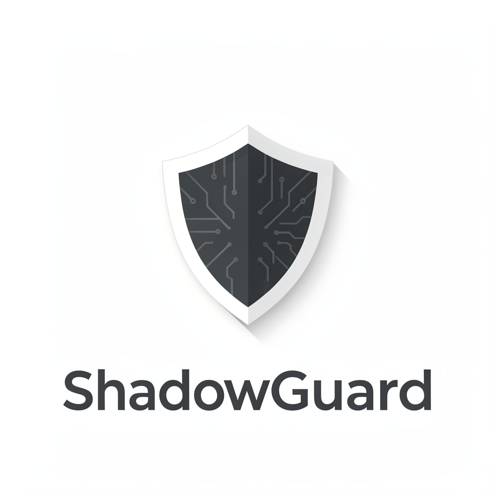
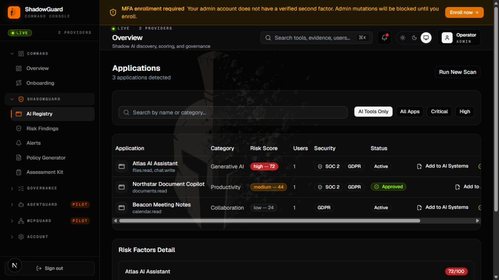
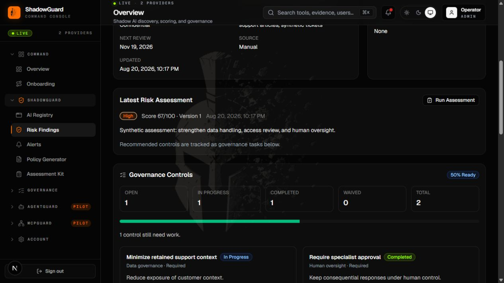
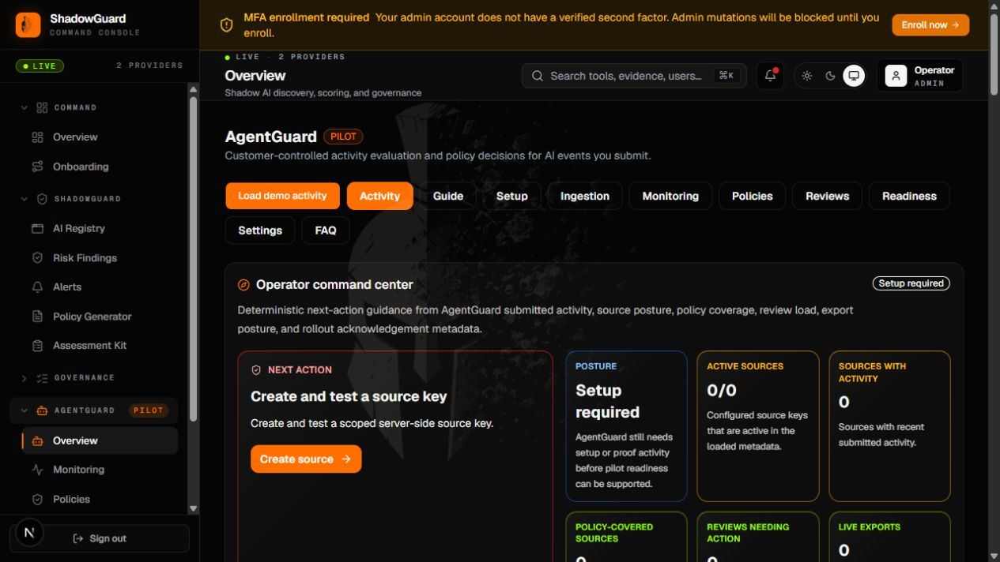
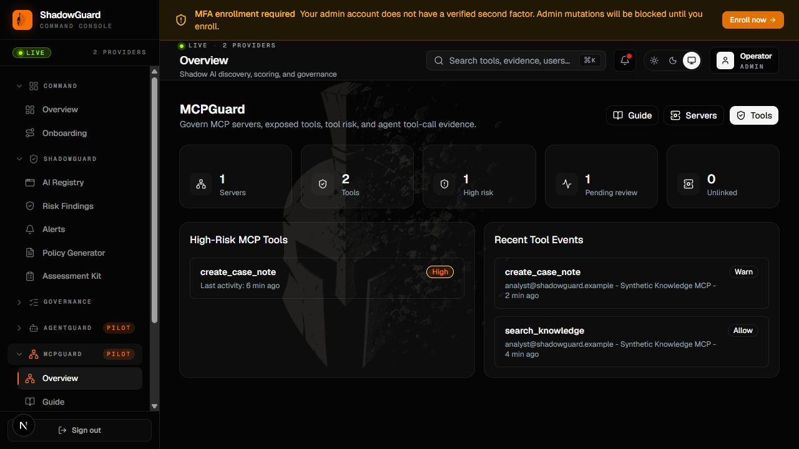

# ShadowGuard

ShadowGuard is an Apache-2.0, self-hosted application for AI discovery,
governance assessments, AgentGuard policy evaluation, MCP governance, evidence,
and reporting.

Created by [RLS Solutions](https://www.rls-solutions.com) and released as a
completed, read-only open-source resource.

It is source code, not a hosted service. Every organization receives the
complete feature set, and there is no owner-operated telemetry, support SLA,
security SLA, uptime commitment, or maintenance promise. Installation operators
provide and fund their own infrastructure and integrations.



## What is included

- Optional Google Workspace and Microsoft 365 application discovery.
- Manual entry and CSV import for AI System inventory.
- AI risk assessments, control tasks, evidence, remediation, review queues,
  governance snapshots, PDFs, client export packs, and audit records.
- AgentGuard source-key ingest, metadata-only policy evaluation, reviews,
  evidence packets, signed HTTPS destinations, and optional Slack workflow
  previews.
- MCP server, tool, and event governance.
- Organization-scoped Supabase RLS, role authorization, MFA gates, same-origin
  mutation checks, rate limiting, encrypted integration credentials, and audit
  logging.

Every authenticated organization can use the complete feature set. Optional
integrations can be absent without disabling the manual governance workflows.

## Screenshots

The following screenshots show representative workflows rendered with synthetic
local data from a self-hosted installation:


*Dashboard and AI inventory using synthetic local data.*


*Governance assessment and report using synthetic local data.*


*AgentGuard policy workflow using synthetic local data.*


*MCPGuard governance workflow using synthetic local data.*

## Architecture

```text
Browser
  │
  ▼
ShadowGuard Next.js application
  ├── Supabase Auth and organization-scoped Postgres/RLS
  ├── Optional Google Workspace / Microsoft 365 OAuth discovery
  ├── Optional Redis-compatible shared rate limiting
  └── Optional customer-owned HTTPS / Slack destinations
```

No ShadowGuard-controlled analytics or monitoring service receives application
traffic. Your Supabase project is the system of record. Raw AgentGuard activity
content is classified in memory; persisted activity records use metadata and
policy outcomes rather than raw prompt, response, file, or message content.

## Local development

### Requirements

- Node.js 22 or later
- npm
- Docker Desktop, Docker Engine, or another Docker-compatible runtime
- Enough resources for the local Supabase stack

The Supabase CLI is pinned as a development dependency. The CLI stack is for
local development and tests only; it is not hardened for public production
traffic.

### Start a clean installation

```powershell
npm ci
Copy-Item .env.example .env.local
npm run db:start
npx supabase status
```

Copy the local API URL, anonymous key, and service-role key reported by
`supabase status` into `.env.local`, then reset once to apply the single initial
migration and deterministic seed:

```powershell
npm run db:reset
npm run dev
```

Open `http://localhost:3000`. Create an account and use the local Supabase email
inbox URL printed by `supabase status` to complete verification. Each verified
signup creates a new isolated organization, even when another user has the same
email domain.

Useful commands:

```powershell
npm run db:start
npm run db:reset
npm run db:stop
npm test
npx tsc --noEmit
npm run lint
npm run build
```

## Environment configuration

The authoritative template is [`.env.example`](.env.example).

Required application settings:

- `APP_BASE_URL` — server-side canonical application origin.
- `NEXT_PUBLIC_APP_URL` — browser-visible application origin, supplied at build
  time.
- `NEXT_PUBLIC_SUPABASE_URL` — browser-visible Supabase API origin, supplied at
  build time.
- `NEXT_PUBLIC_SUPABASE_ANON_KEY` — Supabase anonymous/publishable key, supplied
  at build time.
- `SUPABASE_SERVICE_ROLE_KEY` — server-only privileged key; never expose it to a
  browser or public log.

Optional groups:

- Google Workspace: `GOOGLE_CLIENT_ID`, `GOOGLE_CLIENT_SECRET`, and
  `GOOGLE_REDIRECT_URI`.
- Microsoft 365: `MS_CLIENT_ID`, `MS_CLIENT_SECRET`, `MS_TENANT_ID`, and
  `MS_REDIRECT_URI`.
- Provider-token encryption: `TOKEN_ENCRYPTION_KEY` and version fields.
- AgentGuard destinations: `AGENT_GUARD_EXPORT_SECRET_KEY`.
- Shared rate limiting: both Upstash/Redis REST values.
- CAPTCHA: `NEXT_PUBLIC_TURNSTILE_SITE_KEY` plus matching Supabase Auth
  configuration.

`NEXT_PUBLIC_*` values are embedded by `next build`. Build the application image
for the target public origins; changing only the runtime environment does not
rewrite an existing browser bundle.

## Production deployment

### 1. Operate Supabase

Use the official, versioned [Supabase self-hosted Docker
distribution](https://supabase.com/docs/guides/self-hosting/docker), not the
local CLI stack. Pin a self-hosted release and follow Supabase's published
upgrade notes rather than tracking an unpinned branch. Current self-hosted
Supabase releases use evolving database and API-gateway defaults, so review the
[self-hosting changelog](https://supabase.com/changelog?types=breaking-change)
before every upgrade.

Configure strong generated secrets, external HTTPS URLs, Auth `SITE_URL`, API
external URL, SMTP, backups, and a reverse proxy according to the official
guide. Apply `supabase/migrations/20260820183952_initial_schema.sql` through your
controlled Postgres migration process before starting the application. Do not
load the development seed into production.

### 2. Build the standalone application image

```bash
docker build \
  --build-arg NEXT_PUBLIC_SUPABASE_URL=https://supabase.example.com \
  --build-arg NEXT_PUBLIC_SUPABASE_ANON_KEY=your-publishable-key \
  --build-arg NEXT_PUBLIC_APP_URL=https://guard.example.com \
  --build-arg APP_BASE_URL=https://guard.example.com \
  -t shadowguard:v1.0.0 .
```

Create a production environment file containing the required server-only values
and any optional integrations, then run the image:

```bash
docker run --rm \
  --name shadowguard \
  --env-file .env.production \
  -p 127.0.0.1:3000:3000 \
  shadowguard:v1.0.0
```

Place a hardened TLS reverse proxy in front of both the application and
Supabase. Do not expose the Node.js process, Postgres, Studio, or service keys
directly to the public internet.

`GET /api/health` returns `200` only when required configuration is valid and
the database responds. Failures return a sanitized, non-cached `503`. Use this
endpoint for container health checks without treating it as a complete security
or workflow test.

### 3. Configure callbacks

Replace the example domains with your own exact HTTPS origins:

- Supabase Auth Site URL: `https://guard.example.com`
- Supabase Auth redirects:
  `https://guard.example.com/auth/callback` and
  `https://guard.example.com/login/reset-password`
- Google callback: `https://guard.example.com/api/auth/google/callback`
- Microsoft callback: `https://guard.example.com/api/auth/microsoft/callback`

Only configure provider callbacks for integrations you actually enable.

## Team membership

Matching email domains never grant access to an existing organization. First
have the target user create, verify, and bootstrap an account. Membership
reassignment is a database-operator procedure; it is not an application RPC
and is not executable by `anon`, `authenticated`, or `service_role`.

From a controlled SQL console connected as the database owner, inspect the
user's current organization, then pass that exact value as the fourth argument:

```sql
select id, org_id, role
from public.users
where id = '<verified-auth-user-uuid>'::uuid;

select private.assign_organization_member(
  '<verified-auth-user-uuid>'::uuid,
  '<target-organization-uuid>'::uuid,
  'viewer',
  '<expected-current-organization-uuid>'::uuid
);
```

The third argument accepts only `viewer`, `manager`, or `admin`. The operation
aborts if the verified user's current organization differs from the explicit
fourth argument, preventing an accidental overwrite based only on a known user
UUID. Successful changes are recorded in `audit_events`. Do not grant this
procedure to application or API roles; use a reviewed database-owner session
and retain the operational record for each reassignment.

## Backups, updates, and operating costs

The installation operator is responsible for:

- compute, storage, database, email, DNS, TLS, OAuth, Redis, CAPTCHA, Slack, and
  other provider costs;
- Postgres and Storage backups, encryption-key escrow, restore tests, retention,
  high availability, monitoring, and capacity;
- operating-system, container, dependency, Supabase, and application updates;
- user lifecycle, incident response, disclosure channels, and applicable legal
  or regulatory obligations.

Back up the database, Storage objects, and the encryption keys required to read
encrypted records. Test restores on a separate environment. Review migration
SQL, Supabase breaking changes, and RLS behavior before every upgrade.

## Security limitations

Read [SECURITY.md](SECURITY.md) before deployment. In particular:

- never put a service-role key, OAuth secret, token encryption key, source key,
  or destination secret in a `NEXT_PUBLIC_*` variable;
- validate RLS and cross-organization denial after local schema changes;
- use HTTPS and a reverse proxy with request-size, timeout, and rate controls;
- enable and test backups; local development defaults are not production
  hardening;
- treat reports and generated policies as operational evidence and editable
  drafts, not legal advice, certification, auditor attestation, or warranties.

## Project status and license

ShadowGuard is provided as-is under the [Apache License 2.0](LICENSE). The
upstream `v1.0.0` snapshot is intended to be archived read-only. No hosted
service, implementation assistance, issue response, roadmap, security response
time, remediation time, or continued development is guaranteed.

See [NOTICE](NOTICE) for branding and non-endorsement terms and
[CONTRIBUTING.md](CONTRIBUTING.md) for the archived-project contribution model.
